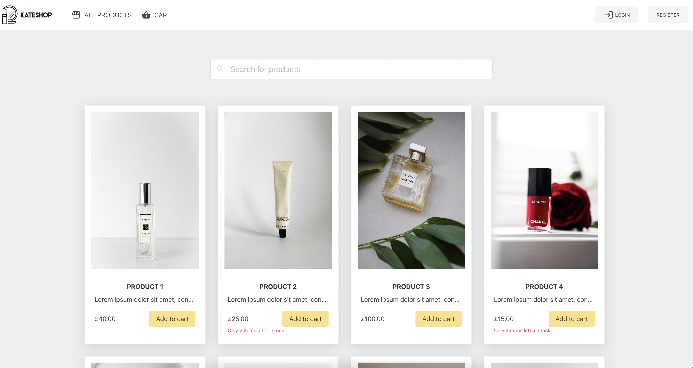
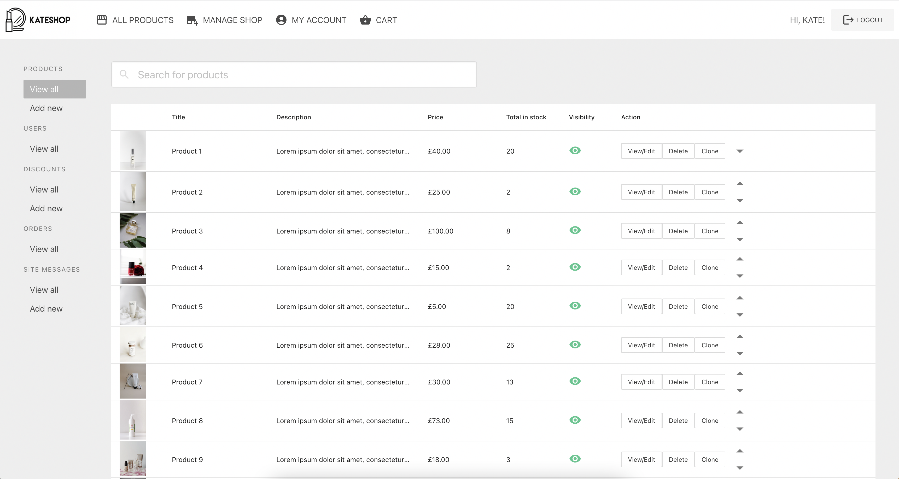

# About

Kateshop is a full-stack app built with React.js on the frontend and Node.js with MongoDB on the backend.

Features for Customers:

* Browse, search, and view detailed product information
* Add or remove products from cart, change quantity, and apply discounts
* Checkout as guest or create an account to keep track of past orders
* Manage account information, including changing password/username, viewing past orders, and deleting the account

Manage shop features:

* Manage stock levels, update product information, and change product positions
* Adjust user privileges, such as granting access to staff or admin-level users
* Add or remove current promotions and customize offers
* View order history, locate users who have placed orders, issue refunds, and cancel orders
* Add site-wide messages, such as notifying customers of new promotions or site maintenance

Some of upcoming features:
* Payment system integration
* Product reviews and rating systems available to registered customers
* Password reset emails
* UI/UX enhancements

# Getting Started 

After you clone the project, please run: 
### `npm i` 
in the following directories:

* **root** (kateshop)
* **client**
* **server**

To run the project, open two terminals and simuntaniously run server and client:

Terminal 1:
### `cd server` 
### `nodemon server.js` 

Terminal 2:
### `cd client` 
### `npm start` 

